## What it is

Jeeves is 1 page in your web browser, served by a small program on your own computer. The page is split into panels. Each panel does 1 job. You can drag a panel anywhere, stack panels as tabs, close a panel and bring it back, make a group of panels fill the screen, and pop any panel out into its own window so it can sit on a second screen.

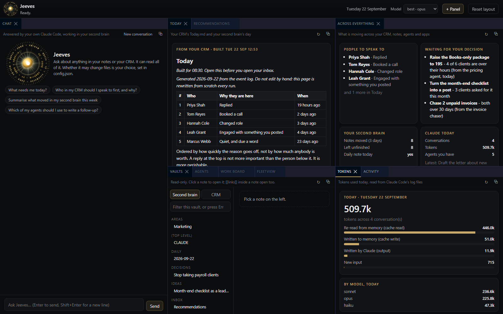

The numbers on the next picture point at the parts you will use most. The key under the picture says what each one is.

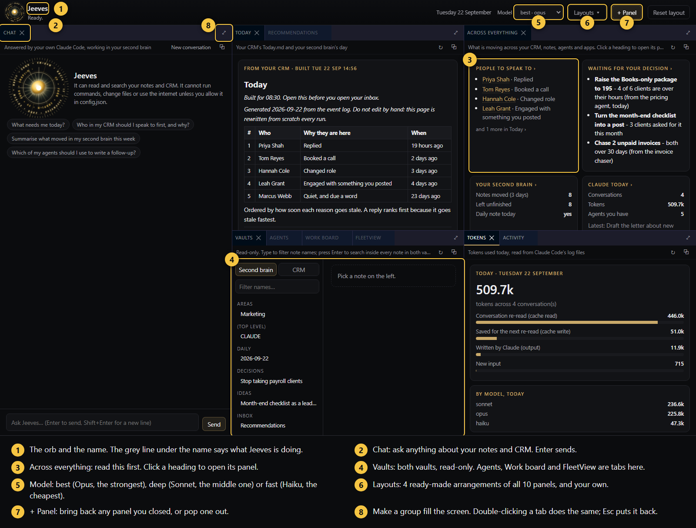

The 10 panels:

| Panel | What you see |
|---|---|
| Chat | A conversation with your own Claude Code. It works inside your second-brain folder, with your CRM folder added, so it can read both. By default it can read and search, and nothing else. |
| Today | The ranked `Today.md` page your CRM builds each morning (the daily list from part 7 of the CRM series, a file called `Today.md` at the top of your CRM folder), plus your second brain's day: today's daily note if you keep one, notes that changed in the last 3 days, and boxes you left unticked. |
| Across everything | 1 screen that sums up what is moving: people to speak to, decisions waiting for you, notes that changed, Claude use today, and whether your other apps are running. Click any heading to open its panel. |
| Recommendations | A markdown file in your second brain that you and your agents write suggestions into. |
| Vaults | Both vaults, read-only. Filter by name, search inside every note, click a `[[link]]` to follow it. |
| Agents | Every Claude Code agent you have, with what each one is for, and an "Ask in chat" button. |
| Activity | Your recent Claude Code conversations: which folder, how many turns, how many tokens. |
| Tokens | Today's tokens, by kind and by model, read from Claude Code's own log files. |
| Work board | ProjectForge (piece 3) inside the panel, when it is running. |
| FleetView | FleetView (piece 2) inside the panel, when it is running. |

At the top left, and above the chat, is the orb: an animated circle of light and runes. It turns slowly when Jeeves is idle, pulses while Claude is thinking, and brightens while the answer is coming in.

## Why you would want it

Once you run agents, your work is spread across folders, terminals and apps. The CRM knows who to call. The second brain knows what you decided. Claude Code knows what it did today, and how many tokens it used doing it. None of them shows you the others.

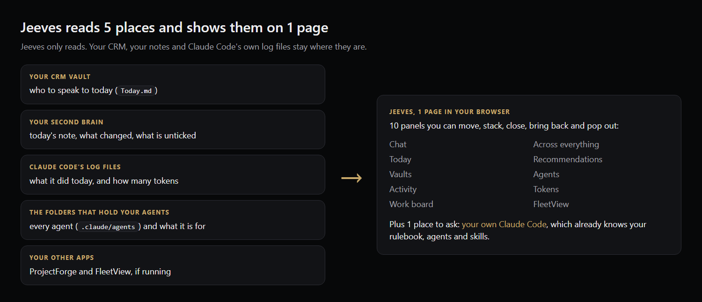

Jeeves puts them on 1 screen and gives you 1 place to ask a question about any of them. The answer comes from your own Claude Code, so it already knows your rulebook, your agents and your skills. It costs nothing beyond your Claude subscription, and nothing leaves your computer except the messages Claude Code itself sends.

Ashley's ruling on what Jeeves is for, made on 2026-06-20: it is a full cockpit where every ability is a panel, not a chat box with an orb. "Jeeves is a FULL UI - that's the point." This download keeps that: every panel stays, and the Layouts menu arranges them for the screen you have.

## How we built it

Ashley built the original Jeeves for himself in June 2026. This section tells that build in order, from his build notes and records, with pictures of his real screens. The download you get is a clean rebuild of the parts that worked, for your setup rather than his.

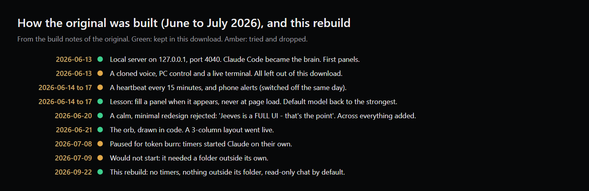

### 2026-06-13: most of the system in 1 day

- **A web server on 127.0.0.1, port 4040**, written with Python's own library and nothing to install. 127.0.0.1 means "this computer only": nothing on your network can reach it. We kept this exactly.
- **The brain transplant.** The first version pinned a small model and did its own searching in Python, badly. It was replaced by a runner that drives the real Claude Code (`claude -p`) with every vault attached. We kept this idea: Jeeves has no brain of its own.
- **Permission tiers.** 3 levels: refuse, ask Ashley first, or allowed. Then control of the PC itself (screenshots, opening programs, typing), with clicks and keypresses needing approval.
- **Voice.** 5 speech engines were compared. The winner, Chatterbox (MIT licence), ran a cloned voice made from a well-known narrator's audiobook clips. It took 34 seconds to start and about 4 seconds per reply once warm. The clone was marked private-only, because the narrator has publicly objected to voice cloning.
- **The mic "not working"** turned out to be a silent virtual device set as the Windows default. Fixed with a picker that skips virtual devices.
- **Dockview panels** (Dockview is a free library for web pages whose panels you can drag and dock), a 3D map of agents, a live PowerShell terminal, a fast/deep model switch, email and calendar readers, a 45-minute watch pass, and the first Inbox panel.

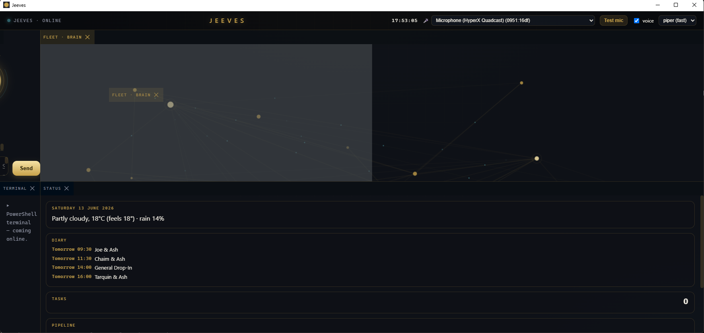

### 2026-06-14 to 2026-06-17: additions

- **A heartbeat every 15 minutes** that researched new items before Ashley ruled on them.
- **Phone alerts** were built and switched off the same day, on Ashley's word.
- **A dead panel.** The Status panel looked for its box when the page loaded, before Dockview had built it, and stayed empty. The lesson: fill a panel when it mounts, never at page load. This rebuild does that for every panel.
- **Embedded apps.** ProjectForge and the outreach app were shown as real apps inside panels, and any panel could pop out into its own window for his 3 monitors.
- **"Jeeves suddenly dumb."** The default model had been switched to the smallest, fastest one. It fumbled tasks with several steps. Ruling: the strongest model by default. This rebuild's default is `best`.
- **Speed.** Keeping 1 Claude process running between messages cut the time to the first word from 3,704 ms to 1,381 ms.
- **The phone app** was installed on 2026-06-15. The login screen trapped the phone in a dead end, and Ashley ruled "get rid of all the auth": the private network became the only way in.
- **Telegram** as a way to reach Jeeves was removed on 2026-06-16. Jeeves replaced it.


### 2026-06-20: the redesign Ashley rejected

A new design went through research, a plan, a critique, a second plan, a second critique and a final plan. It proposed a "calm butler": 1 orb, 1 conversation, at most 4 cards, with the terminals and the agent map removed. Ashley's verdict: "it looks better but it uses most of the current usability", then "Jeeves is a FULL UI - that's the point". The plan was corrected to keep every panel and add a column that sums up what is moving across conversations, projects, outreach and agents. In this download that column is the **Across everything** panel.

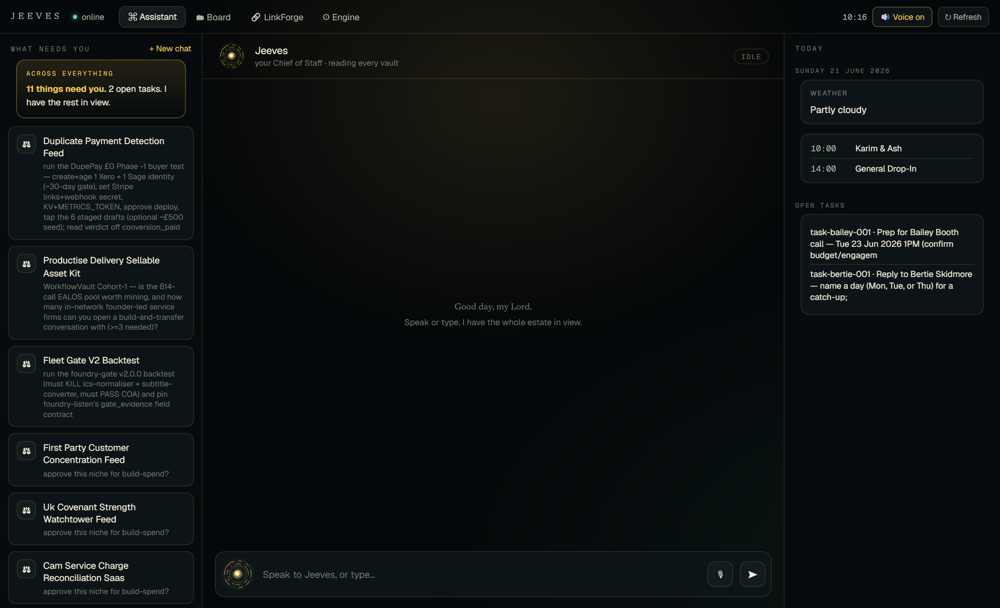

### 2026-06-20 to 21, overnight: the orb

Ashley wanted Jeeves to look like a character from an anime. Claude guessed the look wrong twice. The fix was an original animated circle drawn in code (SVG, a way of drawing shapes in a web page), so no copyrighted picture ships with it. In the original it reacted to the microphone and to the voice. This download has no microphone and no voice, so its orb reacts to what Chat is doing instead. Its 2 rings of runes each spell out a line of text, and the text is yours to set.


### 2026-06-21 to 2026-07-09: the new layout, then the pause

- **2026-06-21:** a 3-column layout went live as the default, with the old one kept at `/v1`.
- **2026-06-22:** a separate hands-free voice-control program was built and archived the same day. About half a second at best, plus the time for an AI answer, was not fast enough.
- **2026-07-01 to 02:** a code audit found that the login store failed open (let people in) if its file was damaged. It was fixed to lock instead. It also found that Jeeves started its own copy of the outreach app on a shared port, and the outreach app quietly reused that copy, so a fix to the outreach app looked dead.
- **2026-07-08:** the last heartbeat. Jeeves was paused for token burn. On the same date ProjectForge was stopped for using about 230 million input tokens in 30 days. The Jeeves heartbeat and watch pass each started a fresh Claude session on a timer, which is the same pattern. No separate token count for Jeeves was recorded.
- **2026-07-09:** the last attempt to start it failed, because a folder it needed (the voice code) was missing. The server would not run without files that lived outside its own folder.

### 2026-09-22: what testing this download found, and fixed

Before this download went out, a stranger followed this guide step by step, a reviewer drove every panel, and a security reviewer tried to break it. What they found, and what changed:

- **Chat was not truly read-only.** The setting it used refused only tools you had not already allowed elsewhere in Claude Code. Now Jeeves hands Claude Code a list of blocked tools on every message. See "What Chat can and cannot do" below.
- **Stop did not stop Claude** when Claude Code was installed with npm (a Node.js installer), because that install runs the real Claude as a second program. Stop now ends both.
- **2 copies could share port 4040 on Windows**, and `--stop` then stopped only 1. Now only 1 copy can run per port, and starting it again says it is already running.
- **After 1 failed message, every later message failed**, because the failed conversation's number was saved. A failed message is now never saved.
- **On a laptop, the chat box slid off the bottom of the screen** after the first answer. Fixed, and a test now checks it at laptop size.

### What this download keeps, and what it drops

| Kept | Dropped, and why |
|---|---|
| Local server on 127.0.0.1 | Timers of any kind: the token burn |
| Claude Code as the brain | The cloned voice: legal and reputational risk |
| Every ability as a Dockview panel, with pop-out | Login screen and phone app: loopback only, so neither is needed |
| The orb | PC control and the terminal: too much power for a first install |
| A summary of everything (the corrected redesign) | Starting other apps: the shared-port clash |
| The best model by default | Anything outside its own folder: the failed start on 2026-07-09 |

## Pros and cons

| | Pros | Cons |
|---|---|---|
| Cost | Nothing runs on a timer. Reading your vaults and logs costs 0 tokens. | Every chat message is a Claude Code run, and each run re-reads your rulebook and the conversation so far. We did not measure that figure for a member's setup. |
| Speed | The reading panels never start Claude, so they answer without an AI wait. | No Claude process is kept warm, so the first word takes longer than the original's 1,381 ms. |
| Brain | Your own Claude Code: every agent, skill and rulebook you have. | If Claude Code is not installed or not logged in, Chat cannot answer (every other panel still works). |
| Safety | 127.0.0.1 only; vault panels only read; Chat can only read and search unless you allow more. | Chat refuses when you ask it to edit a note or run a command, until you change 2 settings. |
| Breadth | 10 panels, all movable, 4 ready-made layouts, layout saved. | It is a browser tab, not its own app window. |
| Install | Python's own library: nothing to pip install. | The 5-hour window figure needs `ccusage`, which needs Node.js. |

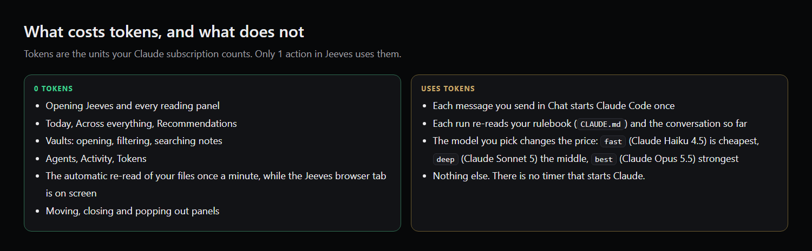

## Before you start

| You need | How to check |
|---|---|
| Python 3.8 or newer | In a terminal: `python --version` (on a Mac: `python3 --version`) |
| Claude Code, logged in | `claude --version` prints a number (2.1.278 on 2026-09-22), and typing `claude` opens it without asking you to log in |
| Git | `git --version` |
| Your second brain | The folder from the second-brain series. Its path, for example `C:\Users\<you>\Documents\Second Brain` |
| Your CRM (optional) | The folder from the CRM series. Without it, Today shows only your second brain |
| ccusage (optional) | `ccusage --version`. Needs Node.js; install with `npm install -g ccusage` (version 20.0.24 on 2026-09-22) |

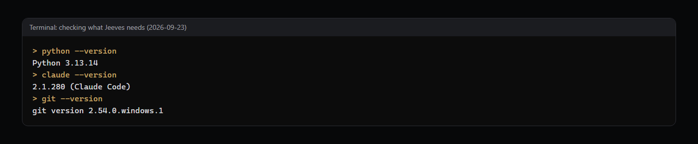

> **Tip:** Want to see Jeeves before pointing it at your real notes? After step 2 below, run `python tools/demo.py ../jeeves-demo --serve --port 4099`, then open http://127.0.0.1:4099/ . It builds a made-up bookkeeper with 2 vaults and 5 agents. The chat answers from a script and costs 0 tokens. Press Ctrl+C in that terminal to stop it.

## Install it

1. Open a terminal in the folder where you keep your downloads.
2. Clone the repo and go into it:

```
git clone https://github.com/OUTLIERS-ai/outliers-ws-04-jeeves
cd outliers-ws-04-jeeves
```

3. Run the installer:

```
python install.py
```

4. It checks Python and Claude Code first. If either is missing it says what to do and changes nothing.
5. It asks 4 questions. Press Enter to accept the answer in brackets, which is what it found:
   - where your second brain is (it reads the path your second-brain installer recorded)
   - where your CRM is (the same, from the CRM installer; leave it blank if you have none)
   - where your agents are (normally the `agents` folder inside `.claude` in your home folder)
   - which port to use: the number after the colon in the address, 4040 unless another program is using it. Type a number; anything else and it asks again.
6. It asks whether to start Jeeves hidden every time you log in. The default is no. If you say yes on Windows, it puts a small file called `Jeeves.vbs` in your Startup folder that starts Jeeves with no window. On a Mac it writes a launch file and prints the 1 command that switches it on. On Linux it prints a line to add with `crontab -e`.
7. It writes `config.json` next to `install.py`. On Windows it also writes `Start Jeeves (hidden).vbs` in the same folder, and if you change an answer it keeps your old settings as `config.json.bak-<date>`. When Jeeves runs it keeps its own working files in a `state` folder here. Run the installer again with the same answers and it says "Nothing changed".

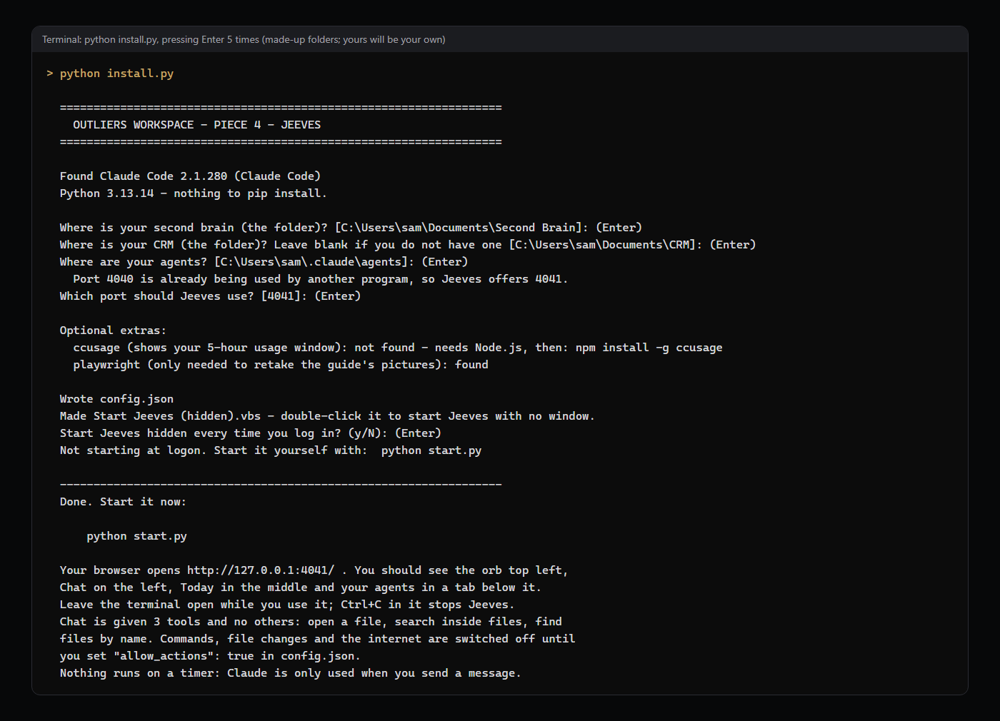

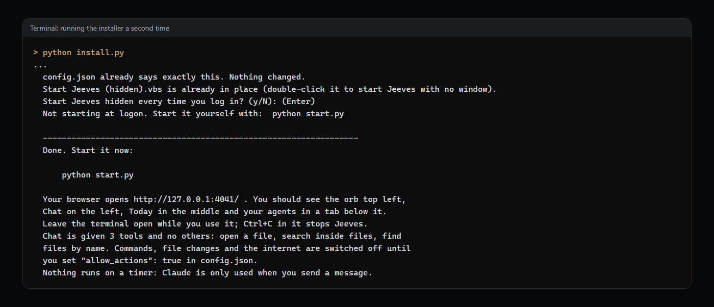

8. Start Jeeves:

```
python start.py
```

9. The terminal prints "Jeeves is running at http://127.0.0.1:4040/ (Ctrl+C to stop)" and your browser opens that address. There is no login. Leave that terminal window open while you use Jeeves. Press Ctrl+C in it, or close it, to stop Jeeves.
10. The first time you send a chat message, Claude Code starts up, which can take several seconds before the first word appears.

When it worked you see the orb top left, Chat on the left, Today in the middle and the summary on the right. On a screen narrower than 1,440 pixels (most laptops) Jeeves starts in the Laptop layout instead: Chat on the left, a tall stack of tabs on the right.

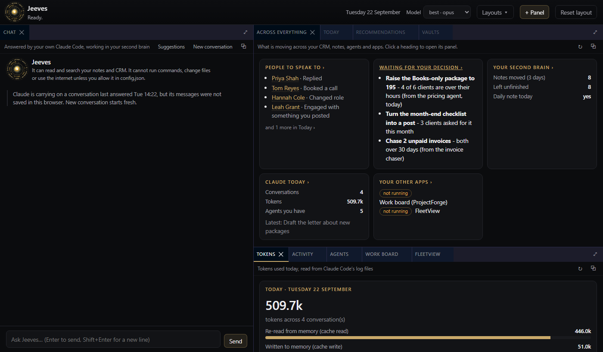

> **Tip:** On Windows, double-click `Start Jeeves (hidden).vbs` to start Jeeves with no window. It does not open your browser: go to http://127.0.0.1:4040/ yourself, and bookmark it. Stop it with `python start.py --stop`.

> **Tip:** Changed your mind about starting at logon? `python install.py --uninstall` stops Jeeves and removes the Startup file (or the Mac launch file). It leaves your settings and vaults alone. To remove Jeeves completely, then delete the `outliers-ws-04-jeeves` folder.

> **Warning:** Do not change `"permission_mode"` to `"bypassPermissions"` in config.json. That lets Claude do anything without asking, from a page that is always open.

## Using it day to day

**Start of the day.** Open Jeeves and read **Across everything**. It shows the top 4 people from your CRM's Today page, the unticked suggestions in your Recommendations file, how much changed in your second brain, and how much Claude has done today. Click any heading, person or suggestion to open it in its own panel.

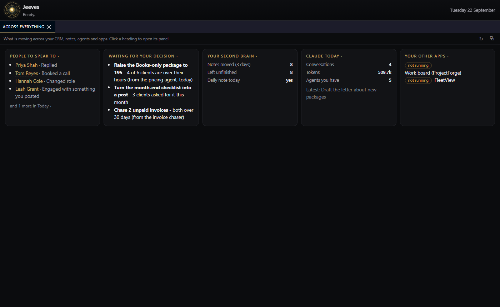

Across everything reads the numbered table in `Today.md`: number, name, reason (`| 1 | Dana Mills | Replied |`). The CRM series writes it in that shape; if you write your own, keep those 3 columns first. If the page is in another shape, the card says so rather than claiming nobody is waiting.

**Today.** Your CRM's ranked page as it is, then your second brain. If you keep daily notes named by date (for example `Daily/2026-09-23.md`, or the same name in a folder called Daily Notes, Journal, Diary or Calendar), today's note appears. Other folders go in `config.json` under `"daily_note_folders"`. If you do not keep daily notes, you still see what changed and what is left unticked. Each note name in brass is a link. Build a fresh CRM page first with `python _engine/today.py --write` in your CRM folder.

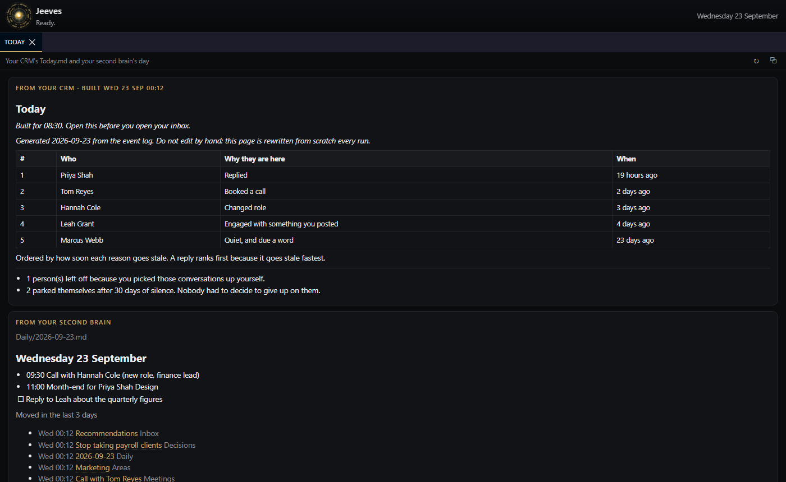

**Chat.** Type and press Enter. Shift+Enter makes a new line. The lines starting with an arrow show which files Claude is reading. While Claude is working, a **Stop** button appears next to Send: press it to end the answer. A message typed while an answer is still coming in is not sent; wait, or press Stop first. A run that goes past 10 minutes is stopped for you (`"chat_timeout_seconds"` in `config.json`). The model menu at the top chooses `best` (strongest), `deep` or `fast` (cheapest); what each maps to is in `config.json`, and your choice is remembered in this browser.

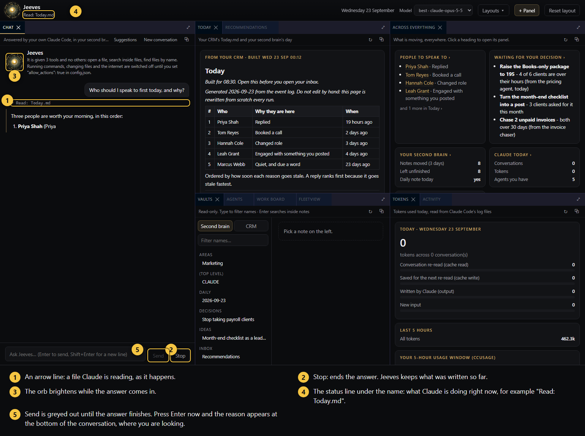

The conversation stays on screen after a reload or a restart, and Claude remembers it too. A grey line says "Carrying on the conversation from" and the time. **New conversation** starts afresh. If you open Jeeves in another browser, Claude still remembers, but the messages are not on screen there; ask "what were we talking about?" to carry on.

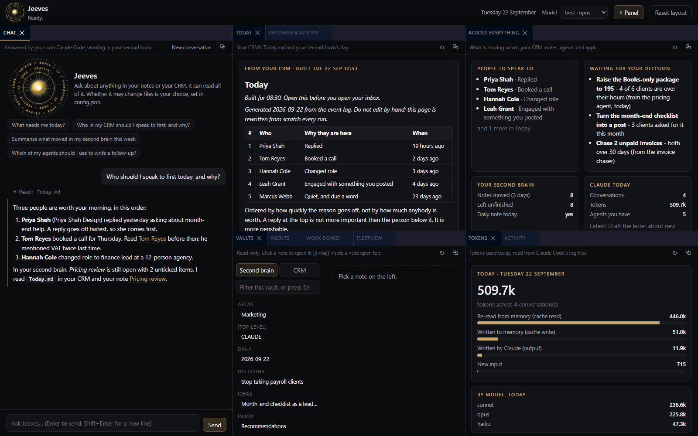

**What Chat can and cannot do.** By default Chat can read and search the files in your 2 vaults, and nothing else. On every message Jeeves gives Claude Code a list of blocked tools: running commands (Bash and PowerShell), writing or editing files, notebooks, fetching web pages and web search. It gives the same list as blocking rules in a settings file, because Claude Code's own documentation (read 2026-09-22) says those rules also apply to any agent Chat hands work to. It also loads none of your add-on servers (MCP servers, which give Claude extra tools such as sending messages). So even a tool you allowed in your own Claude Code settings is not used from Jeeves. To let Chat act, see customisation 5.

**Vaults.** Pick Second brain or CRM and type to filter by note name. Press Enter to search inside every note in both vaults. A `[[link]]` anywhere opens the note in whichever vault has it, and the tab switches to match; if no vault has it, the panel says so and offers to search.

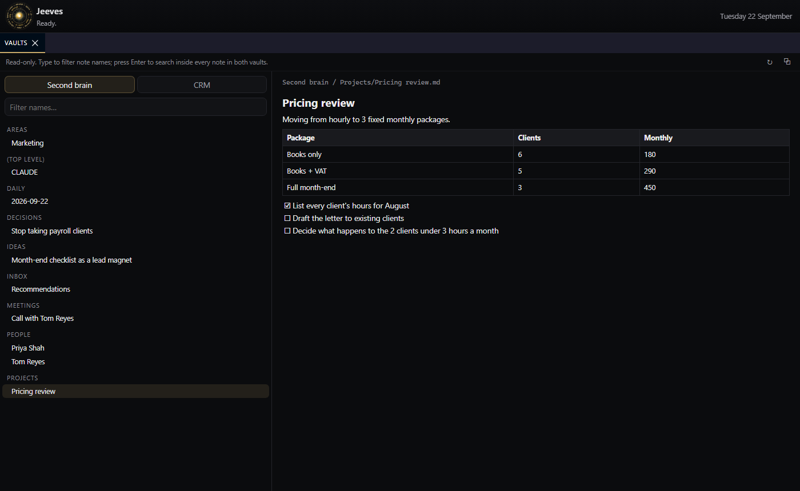

**Agents.** Click a description to read it in full. **Ask in chat** starts a message with "Use the (name) agent to", so you only type what you want done.

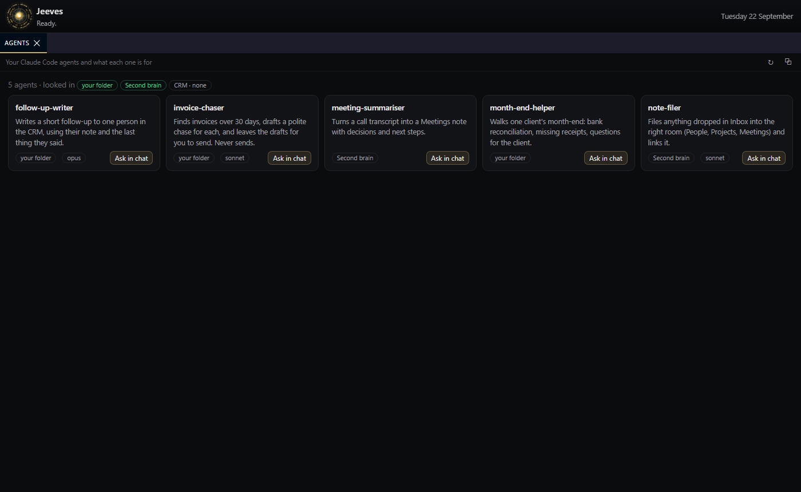

**Activity and Tokens.** Activity lists your Claude Code conversations from the last 7 days. Tokens shows today's total. Most tokens are "cache reads": Claude re-reading the conversation so far. They count towards your limits but are the cheapest kind. The reading panels re-read your files once a minute while the tab is showing; that costs 0 tokens.

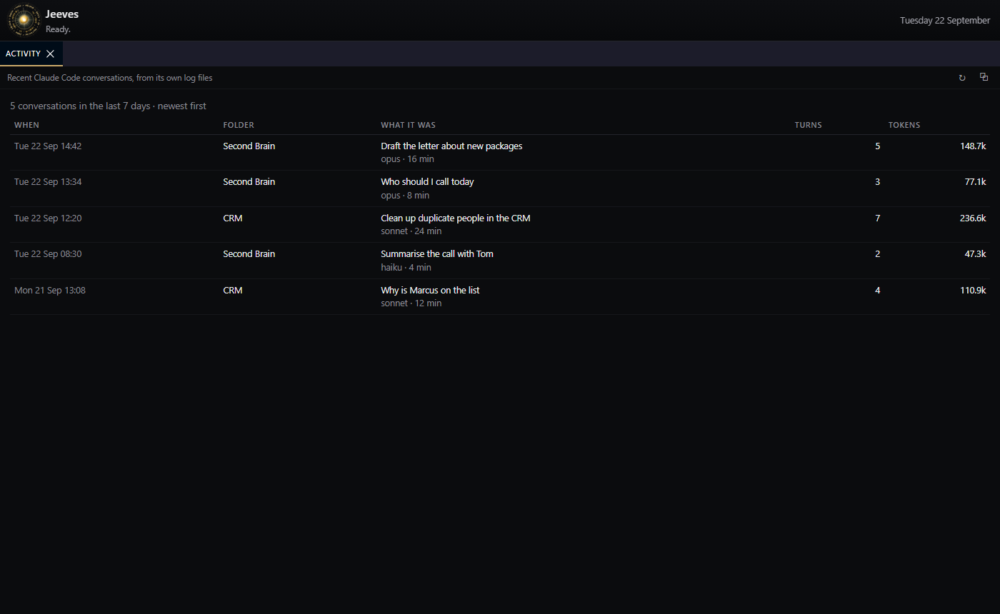

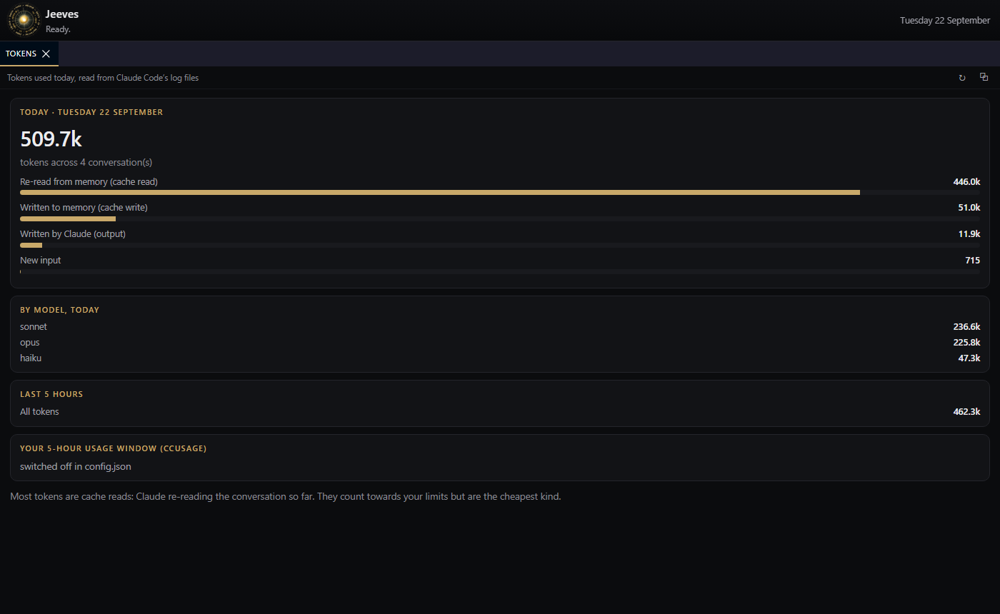

**Recommendations.** Keep 1 file, `Inbox/Recommendations.md`, in your second brain. Ask your agents to add a line there instead of interrupting you. You decide in your own time.

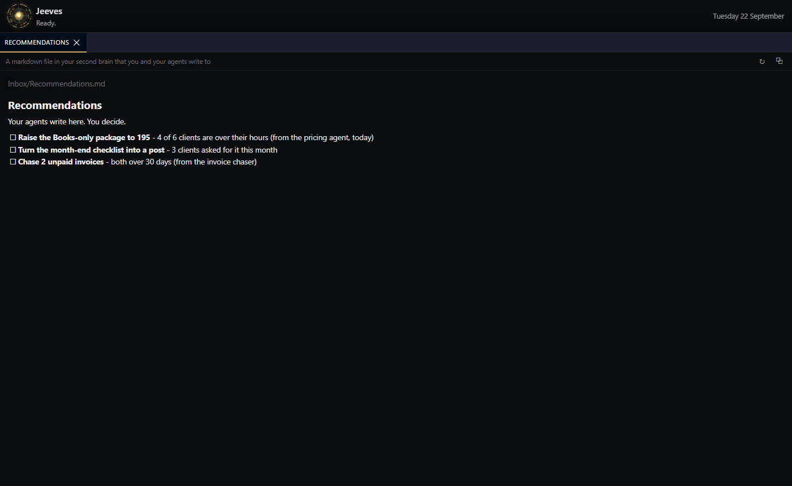

**Work board and FleetView.** If ProjectForge or FleetView is running, it appears inside the panel, with an "open in its own tab" link. If not, the panel says so and gives you the link.

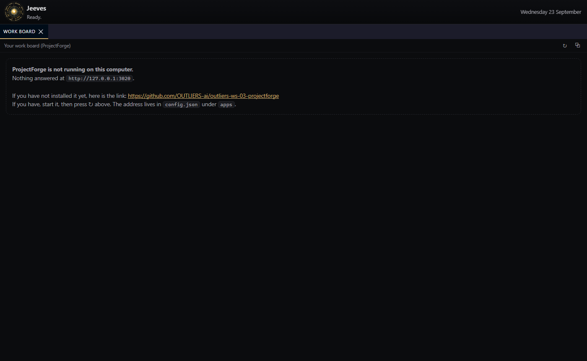

**Moving panels.** Drag a tab by its title to another edge or into another group. The square button on each panel pops it into its own window; the address of a popped-out panel is `http://127.0.0.1:4040/?only=` and the panel's name, for example `?only=today`. **+ Panel** brings back anything you closed (open panels are marked "(open)", and each has its own pop-out button). **Reset layout** puts everything back. Close every panel and the page says so, with a button for each panel.

**Layouts and full screen.** **Layouts** offers 4 arrangements, each with all 10 panels: Big screen, Laptop, Chat focus and Morning review. "Save this layout as" keeps your own arrangement under a name. To make 1 group fill the page, double-click its tab or press the arrow at the right end of its tab row; press Esc to put it back.

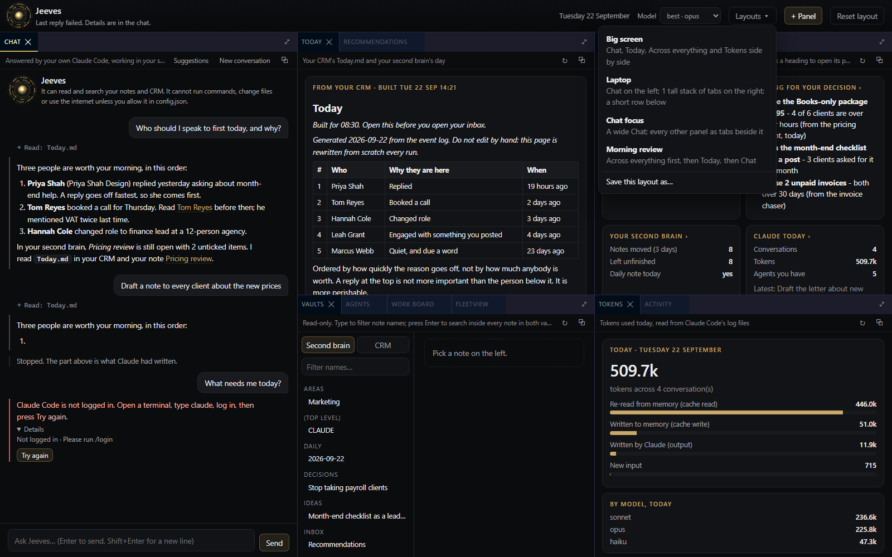

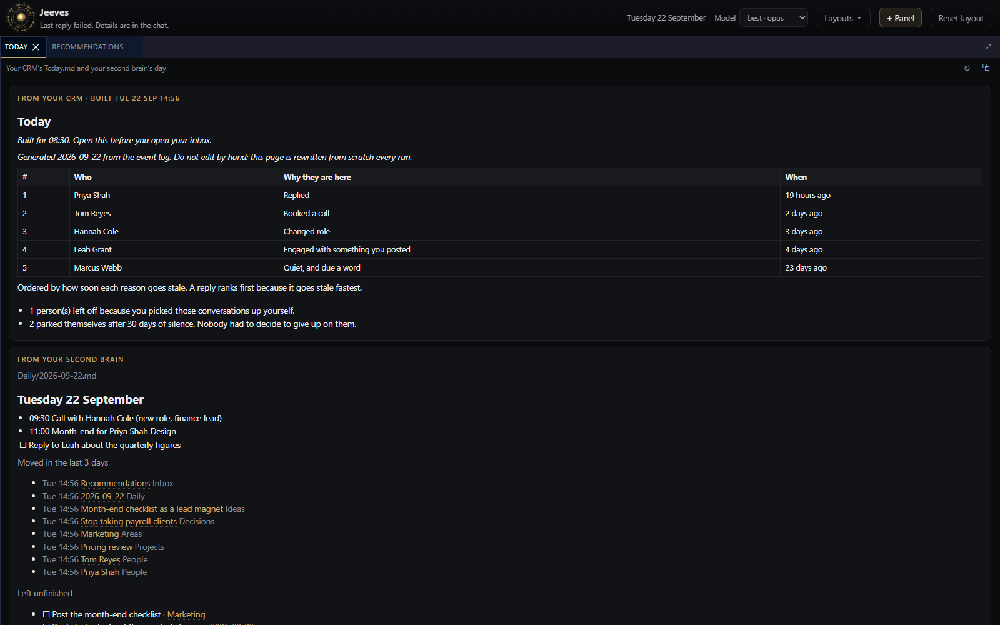

**Stopping it.** Press Ctrl+C in the terminal where you typed `python start.py`. If you started it another way (the hidden file, or at logon), type `python start.py --stop` in the `outliers-ws-04-jeeves` folder. It asks the port first and stops only a Jeeves that answers there.

## Fit it to your own AI system

Each of these is a change you can ask your own Claude Code to make. Open a terminal in the `outliers-ws-04-jeeves` folder, type `claude`, and paste the prompt. Afterwards, run the tests (`python -m pytest -q`) and restart Jeeves.

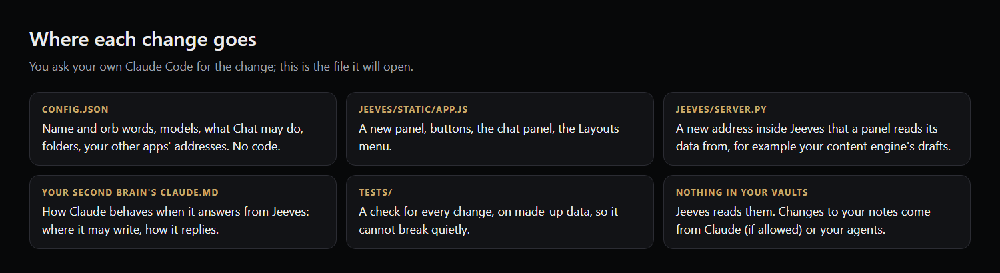

**1. A content-engine panel.** Shows the drafts in your content engine's latest wave.

```
Add a panel to Jeeves called "Drafts". Read-only. It lists the markdown files in the
newest folder under briefs/ in my content engine at <path to outliers-content-engine>,
from each wave's drafts/ folder, with the first line of each draft. Add the path to
config.json as "content_engine". Add a GET route in jeeves/server.py, a render function
in jeeves/static/app.js, and a test in tests/ against a made-up folder. Run the tests.
```

**2. A "who to call" panel with a button per person.**

```
Add a panel called "Who to call" that reads the table in my CRM's Today.md and shows
each person as a card. Each card gets a button "Draft a follow-up" that puts
"Use the follow-up-writer agent to draft a follow-up to <name>, using their CRM note"
into the chat box without sending it. Keep it read-only. Add a test.
```

**3. Your agents as buttons.** Turn the 3 agents you use most into 1-click buttons in the top bar.

```
In Jeeves, add a row of buttons to the top bar for the agents listed in a new
config.json key "agent_buttons" (a list of names). Each button fills the chat box with
"Use the <name> agent to " and focuses it. Nothing is sent until I press Enter.
```

**4. Your own ready-made layouts.** The Layouts menu already saves layouts in your browser. To ship your own to every browser:

```
In jeeves/static/app.js, add a layout called "Client prep" to LAYOUTS: Today and
Vaults side by side on top, Chat below them, every other panel as tabs next to Vaults.
Every layout must keep all 10 panels. Add it to the test in tests/test_ui.py.
```

**5. Let it edit notes, on your terms.** 2 settings, then a rule in your rulebook.

```
In config.json set "allow_actions" to true and "permission_mode" to "acceptEdits".
Then add a rule to my second brain's CLAUDE.md: "When working from Jeeves, only create
or edit files in Inbox/ and Daily/. Ask me before touching anything else."
```

With `"allow_actions": true` Jeeves no longer blocks any tool, so Claude can use every tool your own Claude Code settings allow, including commands and the internet. `"acceptEdits"` lets it edit files without asking; anything else that needs approval is still refused, because nobody is there to approve it.

**6. A voice panel.** Uses the voices already built into your browser, with no cloning.

```
Add a "Speak replies" switch to the Jeeves chat panel. When it is on, read each finished
reply aloud with the browser's built-in speechSynthesis, and set the orb to "speaking"
while it talks. Add a microphone button that uses the browser's speech recognition if
the browser has it, and hides itself if it does not.
```

**7. Recommendations written by your agents.** Give every agent 1 place to put suggestions.

```
In my second brain, add a rule to CLAUDE.md: "Any agent that has a suggestion for me
appends a line to Inbox/Recommendations.md in this form:
- [ ] **<the suggestion>** - <why, with a number> (from <agent name>, <date>)
It never acts on the suggestion itself."
```

**8. Only run when there is work.** If you ever add a scheduled job, make it check first.

```
I want a morning job that asks Jeeves's chat to summarise my day. Before it starts
Claude, it must check with plain Python whether anything changed since yesterday
(new lines in Today.md, new notes). If nothing changed, it exits without starting Claude.
Use a hidden .vbs launcher on Windows and pass CREATE_NO_WINDOW to every subprocess.
```

**9. Change the orb's words and the name.**

```
In config.json set "name" to "<your assistant's name>" and add an "orb" setting with
"inner" and "outer": 2 short lines of my choosing. Restart Jeeves and check the runes
changed.
```

## Every command and setting

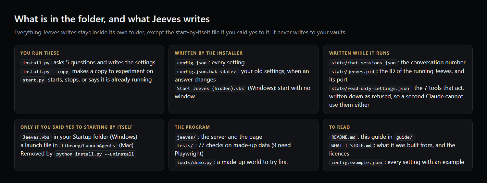

### Commands

| Command | What it does |
|---|---|
| `python install.py` | Asks 4 questions and writes `config.json`. Safe to run again. |
| `python install.py --port 4041` | The same, with a different port. |
| `python install.py --vault <folder> --crm <folder> --agents <folder>` | Gives the answers up front instead of asking. |
| `python install.py --launcher` | Also starts Jeeves hidden at every logon. |
| `python install.py --yes` | Accepts every answer it found, asks nothing. |
| `python install.py --uninstall` | Stops Jeeves and removes the logon launcher. Leaves settings and vaults alone. |
| `python start.py` | Starts Jeeves and opens your browser. Ctrl+C stops it. |
| `python start.py --no-open` | Starts without opening a browser (the logon launcher uses this). |
| `python start.py --port 4041` | Starts on another port this time only. |
| `python start.py --config <file>` | Uses another settings file (the demo uses this). |
| `python start.py --stop` | Stops a Jeeves that is running, however it was started. |
| `python tools/demo.py ../jeeves-demo --serve --port 4099` | A made-up world to try first. 0 tokens. |
| `python -m pytest -q` | Runs the checks, on made-up data. They never touch your real files. |
| `python tools/shoot.py <empty folder> guide/img` | Retakes every picture in this guide (needs the `playwright` package). |

### Settings in config.json

`config.example.json` in the folder shows every setting with an example. After changing one, stop Jeeves and start it again.

| Setting | What it does | Default |
|---|---|---|
| `name` | The name at the top and in the chat. | `"Jeeves"` |
| `port` | The number in the address. | `4040` |
| `second_brain` | Your second-brain folder. Chat works inside it. | asked by the installer |
| `crm_vault` | Your CRM folder. Blank if you have none. | asked by the installer |
| `agents_dirs` | Extra folders of agents. The `.claude/agents` folders in your home and in each vault are always read. | asked by the installer |
| `models` | What `best`, `deep` and `fast` mean. | `opus`, `sonnet`, `haiku` |
| `default_model` | The model picked when you first open Jeeves. | `"best"` |
| `allow_actions` | `false`: Chat can only read and search. `true`: no tools are blocked. | `false` |
| `permission_mode` | Claude Code's own permission setting. `"dontAsk"` refuses anything that would need your approval. | `"dontAsk"` |
| `chat_timeout_seconds` | How long an answer may run before Jeeves stops it. | `600` |
| `claude_command` | How to start Claude Code. If `claude --version` works but Jeeves cannot find it, put its full path here, for example `"C:/Users/<you>/.local/bin/claude.exe"`. | `"claude"` |
| `claude_home` | Where Claude Code keeps its log files, if not the usual `.claude` folder in your home. | blank |
| `inbox_file` | The Recommendations file. If blank, Jeeves looks for `Inbox/Recommendations.md`, then `Recommendations.md`, `Areas/Recommendations.md`, `AI/Recommendations.md` and `Inbox.md`. | blank |
| `daily_note_folders` | Where daily notes are looked for. | `Daily`, `Daily Notes`, `Journal`, `Diary`, `Calendar` |
| `apps` | The addresses of ProjectForge and FleetView, and their download links. | ports 3020 and 3010 |
| `ccusage` | `"off"` skips the 5-hour window figure. | `"auto"` |
| `orb` | 2 lines of text for the rune rings, as `"inner"` and `"outer"`. The installer does not write it; add it yourself. | built in |

### Files it writes

| File | When |
|---|---|
| `config.json` | Every install that changes an answer. |
| `config.json.bak-<date>` | Your old settings, when an answer changed. |
| `Start Jeeves (hidden).vbs` | Every install on Windows. Double-click to start with no window. |
| `Jeeves.vbs` in your Startup folder, or `ai.outliers.jeeves.plist` in `Library/LaunchAgents` on a Mac | Only if you said yes to starting at logon. |
| `state/chat-sessions.json` | The number of the conversation Chat is carrying on. |
| `state/jeeves.pid` | Which program and port are running. |
| `state/read-only-settings.json` | The blocking rules Chat is given. |

`README.md` repeats the short version of this guide. `WHAT-I-STOLE.md` names what Jeeves was built from and each licence. `LICENSE` is the MIT licence for our code; Dockview keeps its own licence in `jeeves/static/vendor/dockview/`.

## When it goes wrong

| What you see | Why | What to do |
|---|---|---|
| Jeeves still answers after `python start.py --stop` | An older copy (before 2026-09-22) let 2 copies share a port on Windows. This copy refuses a second one. | Open Task Manager, end every `pythonw.exe` or `python.exe` running `start.py`, then start Jeeves once. |
| "Jeeves is already running" when you start it | It is: perhaps the hidden file or the logon launcher started it. | Open http://127.0.0.1:4040/ . To restart it: `python start.py --stop`, then `python start.py`. |
| "Claude Code is not logged in", or "No conversation found" | Claude Code needs a login, or it no longer has the old conversation. | Type `claude` in a terminal and log in. Then press **Try again** under the message. |
| Chat says Claude Code was not found | `claude` is not on your PATH, or Jeeves was started from a window that was open before you installed it. | Close every terminal, open a new one, check `claude --version`, then restart Jeeves. If it still cannot find it, put the full path in `config.json` as `"claude_command"`. |
| Chat says it cannot run a command, edit a file or look online | By design: Chat is read-only unless you allow more. | See customisation 5. |
| "Still answering your last message" | You sent a message while the last answer was coming in. | Wait, or press Stop, then send again. |
| Answers feel weak | The original hit this when its default was set to the smallest model. | Pick `best` in the model menu. |
| A panel is empty | The original's Status panel stayed empty because it was filled before it existed. This rebuild fills panels when they appear, so an empty panel now means the data is not there. | Press the refresh arrow on the panel. Read the message in it: it says which file it looked for. |
| "Nobody is waiting on you" but your CRM has people | `Today.md` is not in the numbered shape (number, name, reason). | Rebuild it with `python _engine/today.py --write` in your CRM folder. |
| Work board or FleetView says "not running" | Jeeves only looks. It never starts another app, because the original starting its neighbour caused a clash on a shared port. | Start ProjectForge or FleetView yourself, then press the refresh arrow. |
| An embedded app is blank | An app can refuse to be shown inside another page. | Use the "open in its own tab" link in the panel's top line. |
| Token totals looked doubled | Claude Code writes the same reply more than once in its logs. | Fixed: each reply is counted once. If your numbers still differ from ccusage, ccusage is the reference. |
| "Could not listen on port 4040" | Another program is using the port. | `python start.py --port 4041`, or run `python install.py --port 4041`. |
| It will not start at all | The original failed on 2026-07-09 because a folder it needed lived outside its own. This rebuild needs nothing outside its folder except your vaults. | Run `python install.py` again: it checks everything and says what is missing. |

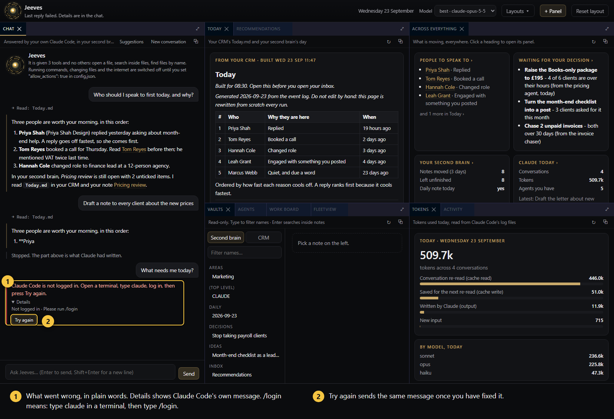

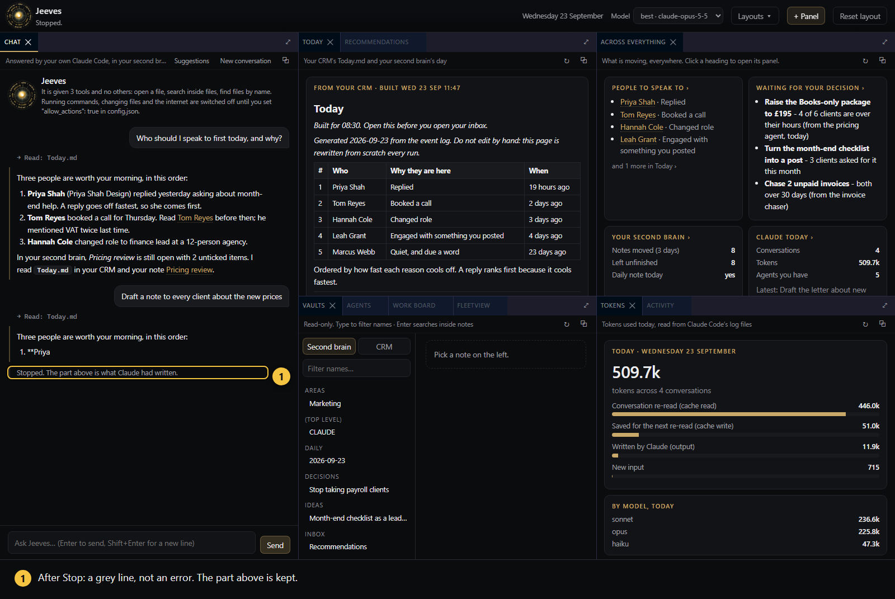

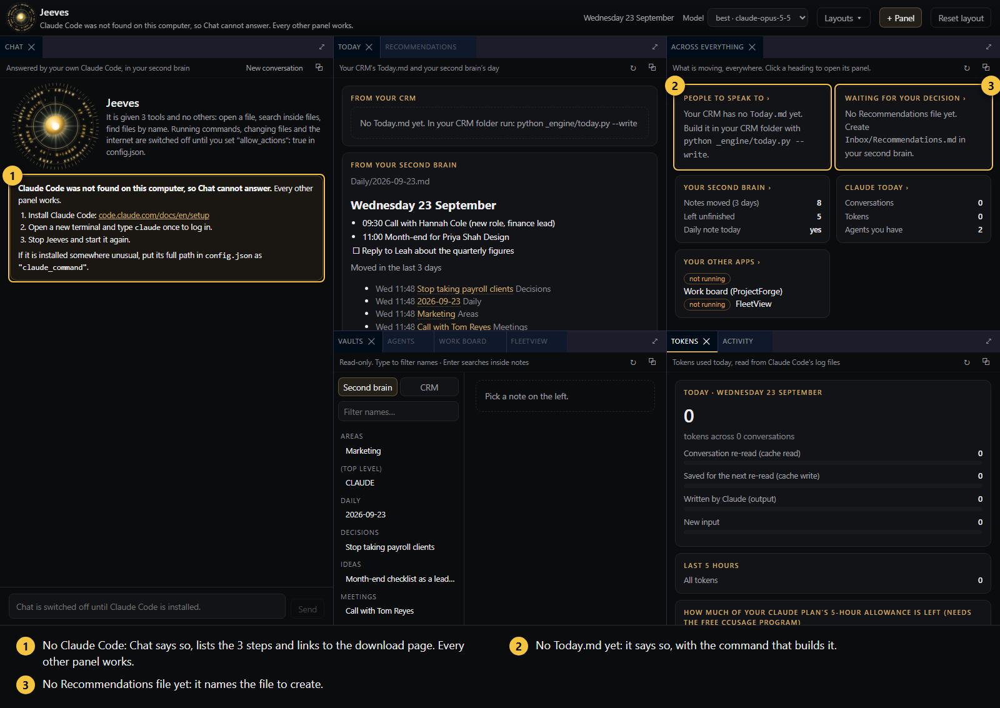

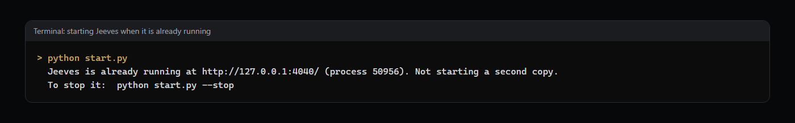

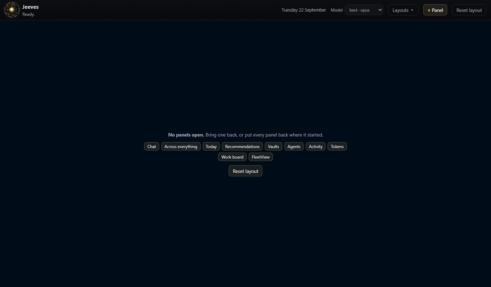

> **Note:** Jeeves never writes to your vaults. If a note changed, something else changed it: Claude through Chat (only if you set `"allow_actions"` to true), or one of your agents.

## Download

https://github.com/OUTLIERS-ai/outliers-ws-04-jeeves

```
git clone https://github.com/OUTLIERS-ai/outliers-ws-04-jeeves && cd outliers-ws-04-jeeves && python install.py && python start.py
```

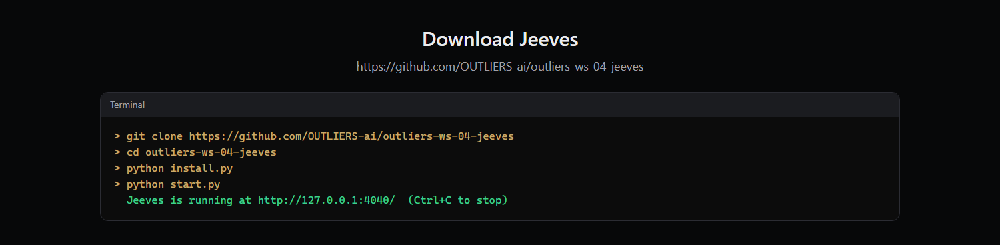

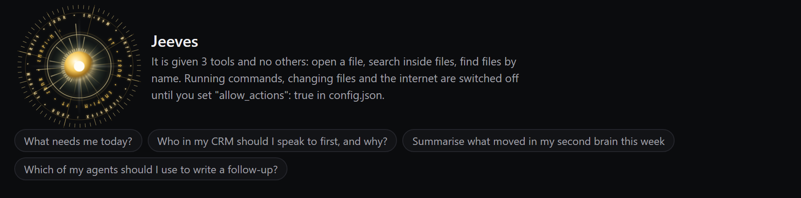
